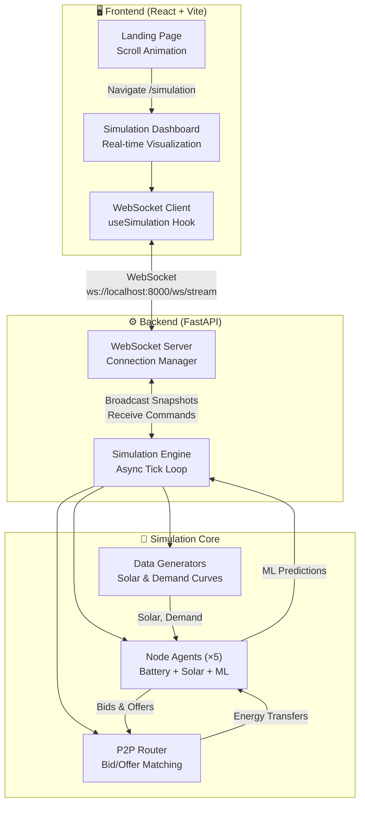
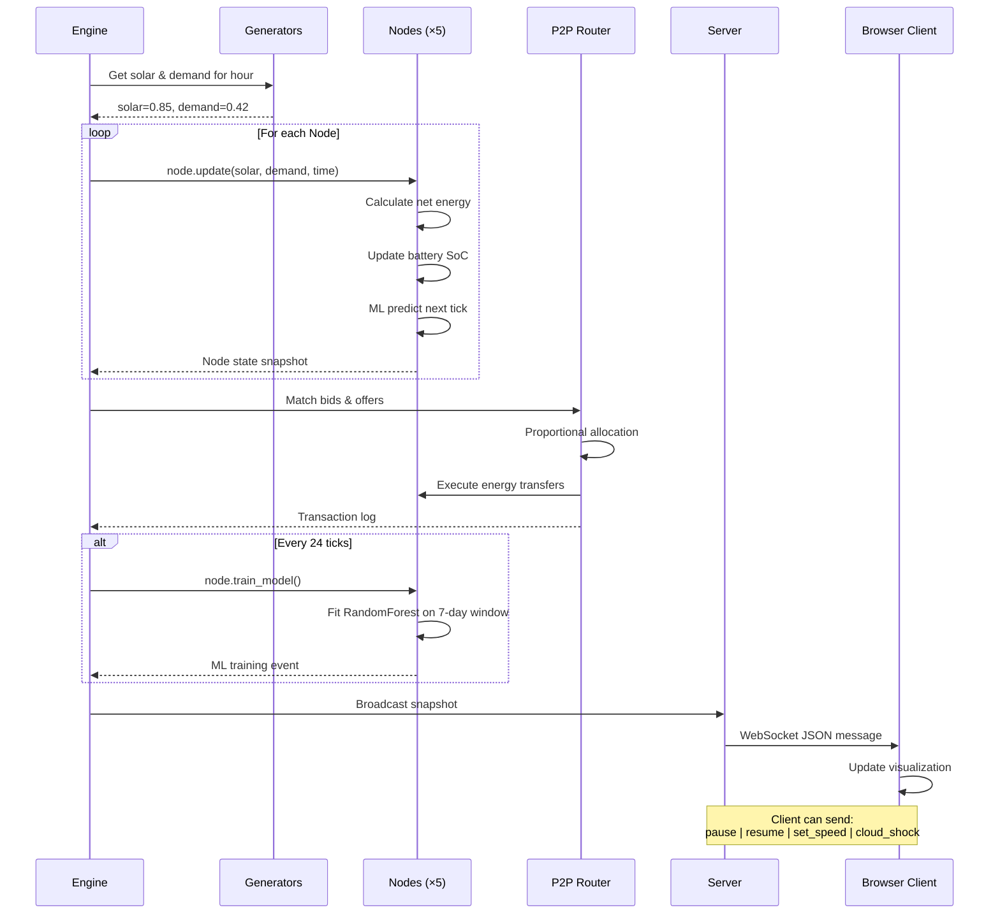
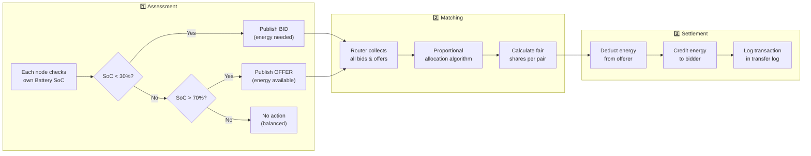
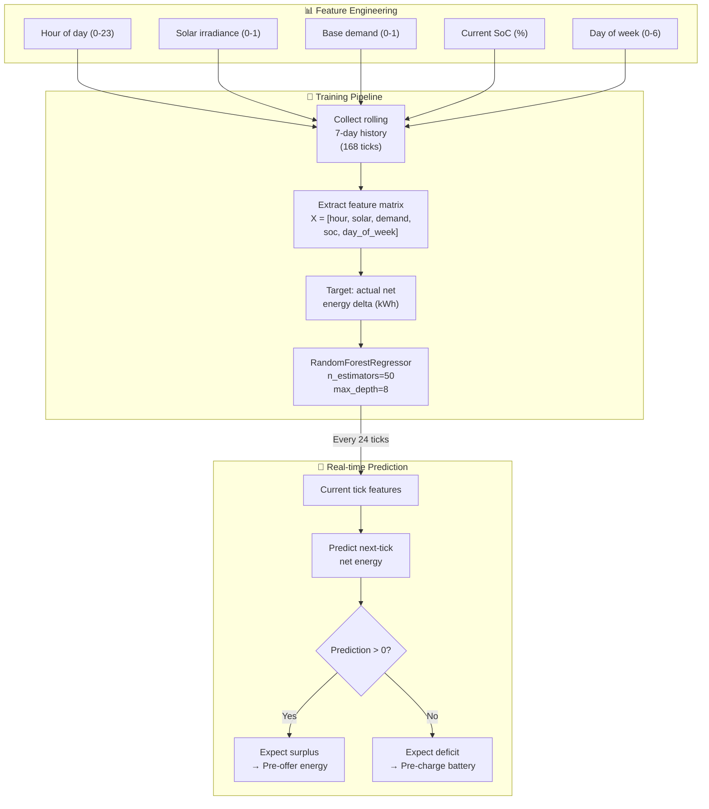

<p align="center">
  
  
  
  
  
</p>

<h1 align="center">⚡ AetherGrid</h1>
<h3 align="center">Decentralized Energy Microgrid Simulation</h3>
<p align="center">
  <em>A real-time interactive dashboard simulating an autonomous peer-to-peer energy microgrid<br/>powered by Random Forest machine learning, with zero central control.</em>
</p>

---

## 🎯 Overview

**AetherGrid** simulates a neighborhood of 5 smart households, each equipped with solar panels and batteries, that autonomously negotiate energy sharing using a decentralized P2P protocol. Each node runs its own Random Forest ML model on synthetic data to predict energy demand and proactively offer or request power — **without any central controller**.

The project ships with:
- 🔬 **Simulation Engine** — Python-based async tick loop with realistic solar/demand curves
- 🧠 **ML Prediction** — Per-node Random Forest models trained on rolling 7-day windows
- ⚡ **P2P Marketplace** — Decentralized bid/offer matching with proportional energy sharing
- 🌐 **WebSocket API** — FastAPI server broadcasting live snapshots at 1 Hz
- 🎨 **Landing Page** — Immersive scroll-expanding hero with storytelling animation
- 📊 **Live Dashboard** — Real-time neighborhood map with node analytics and transfer logs

---

## 📸 Screenshots

| Landing Page | Simulation Dashboard |
|:---:|:---:|
| Scroll-driven storytelling with expanding hero | Live neighborhood map with P2P energy flows |
| ✨ Eco-modernist light theme | ⚡ Real-time WebSocket data |

---

## 🏗️ Architecture

### System Architecture



### Data Flow — Single Tick Lifecycle



### P2P Negotiation Protocol



### ML Pipeline — Per-Node Random Forest



---

## 📂 Project Structure

```
AetherGrid/
│
├── backend/                    # Python simulation engine
│   ├── server.py               # FastAPI WebSocket server + CORS
│   ├── engine.py               # Async tick loop, P2P orchestration
│   ├── node.py                 # Node agent: battery, solar, ML model
│   ├── router.py               # P2P bid/offer matching marketplace
│   └── generators.py           # Stochastic solar & demand curves
│
├── frontend/                   # React 19 + Vite 6
│   ├── index.html              # Entry HTML with Google Fonts
│   ├── vite.config.js          # Dev server + WS proxy config
│   ├── package.json            # Dependencies
│   └── src/
│       ├── main.jsx            # React DOM entry + Router
│       ├── App.jsx             # Route definitions (/ and /simulation)
│       ├── index.css           # Full design system + animations
│       ├── hooks/
│       │   └── useSimulation.js    # WebSocket hook + state management
│       └── pages/
│           ├── LandingPage.jsx     # Scroll-expanding hero + storytelling
│           └── SimulationPage.jsx  # Live dashboard with node map
│
├── requirements.txt            # Python dependencies
├── .gitignore                  # Git ignore rules
└── README.md                   # This file
```

---

## 🚀 Quick Start

### Prerequisites

| Requirement | Version |
|------------|---------|
| Python | 3.11+ |
| Node.js | 18+ |
| npm | 9+ |

### 1. Clone the repository

```bash
git clone https://github.com/YOUR_USERNAME/AetherGrid.git
cd AetherGrid
```

### 2. Backend setup

```bash
# Create virtual environment
python -m venv .venv
source .venv/bin/activate    # macOS/Linux
# .venv\Scripts\activate     # Windows

# Install dependencies
pip install -r requirements.txt
```

### 3. Frontend setup

```bash
cd frontend
npm install
cd ..
```

### 4. Run both servers

Open two terminals:

```bash
# Terminal 1 — Backend (port 8000)
source .venv/bin/activate
uvicorn backend.server:app --host 0.0.0.0 --port 8000
```

```bash
# Terminal 2 — Frontend (port 5173)
cd frontend
npm run dev
```

### 5. Open the app

Navigate to **http://localhost:5173** to see the landing page.  
Click **"Get Started"** or **"Launch Simulation"** to enter the live dashboard.

---

## 🎮 Dashboard Controls

| Control | Action |
|---------|--------|
| ▶️ / ⏸️ | Play / Pause the simulation |
| **1x / 2x / 5x** | Simulation speed multiplier |
| **⚡ Cloud Shock** | Force a 90% solar drop event |
| **Click any node** | Open node detail panel (SoC, ML predictions, stats) |
| **← Home** | Return to landing page |

---

## 🔌 WebSocket API

### Endpoint

```
ws://localhost:8000/ws/stream
```

### Snapshot Schema (Server → Client)

```json
{
  "tick": 142,
  "time": "2026-06-06T22:00:00",
  "hour": 22.0,
  "env_solar": 0.0,
  "env_demand": 0.3842,
  "nodes": [
    {
      "id": 0,
      "charge": 4.21,
      "capacity": 10.0,
      "soc": 42.1,
      "generation": 0.0,
      "demand": 0.38,
      "net": -0.38,
      "prediction": -0.35,
      "has_model": true,
      "blackouts": 0,
      "train_count": 5
    }
  ],
  "transactions": [
    { "from": 2, "to": 0, "kWh": 0.45 }
  ],
  "ml_trained": [],
  "total_p2p_traded": 128.42,
  "paused": false,
  "speed": 1.0
}
```

### Commands (Client → Server)

| Command | JSON Payload |
|---------|-------------|
| Pause | `{"cmd": "pause"}` |
| Resume | `{"cmd": "resume"}` |
| Set Speed | `{"cmd": "set_speed", "multiplier": 5}` |
| Cloud Shock | `{"cmd": "cloud_shock"}` |

---

## 🧪 Key Technical Decisions

### Why Decentralized (No Central Controller)?

Traditional microgrid simulators use a central optimizer. AetherGrid's P2P router operates as a **message bus** where each node independently publishes bids/offers. The matching algorithm is purely reactive — it doesn't know about future demand or global state. This mirrors real-world blockchain-based energy trading protocols.

### Why Random Forest over LSTM/Neural Networks?

| Factor | Random Forest | LSTM |
|--------|:---:|:---:|
| Training speed | ✅ ~10ms | ❌ ~10s |
| Works with small data | ✅ 168 samples | ❌ Needs 1000+ |
| Interpretable | ✅ Feature importance | ❌ Black box |
| Overfitting risk | ✅ Low | ⚠️ Moderate |
| Real-time feasible | ✅ Yes | ⚠️ GPU needed |

For a household with 7 days of hourly data, Random Forest provides excellent accuracy with negligible latency.

### Why WebSocket over REST Polling?

The simulation produces ~1 snapshot/second. REST polling would require the client to hammer the server. WebSocket provides:
- **Push-based** delivery (no wasted requests)
- **Bidirectional** communication (client sends commands back)
- **Sub-millisecond** latency for real-time visualization

---

## 🧬 Simulation Parameters

| Parameter | Default | Description |
|-----------|---------|-------------|
| `num_nodes` | 5 | Number of household nodes |
| `time_step_hours` | 1.0 | Logical hours per tick |
| `tick_rate_seconds` | 1.0 | Real seconds between ticks |
| `_BID_SOC_THRESHOLD` | 30% | SoC below which nodes request energy |
| `_OFFER_SOC_THRESHOLD` | 70% | SoC above which nodes offer energy |
| `_ML_TRAIN_INTERVAL` | 24 ticks | Retrain ML model every simulated day |
| Battery capacities | 10–18 kWh | Varied across nodes |
| Solar panel ratings | 3.0–5.0 kW | Varied across nodes |

---

## 🎨 Design System

AetherGrid uses an **eco-modernist light** palette inspired by sustainable architecture:

| Token | Color | Usage |
|-------|-------|-------|
| `--primary` | `#006d36` | Actions, active states |
| `--primary-container` | `#4ade80` | Highlights, badges |
| `--secondary` | `#00668a` | Data readouts |
| `--error` | `#ba1a1a` | Deficit, critical states |
| `--background` | `#f7f9fb` | Page background |
| `--on-surface` | `#191c1e` | Body text |

**Typography**: Manrope (all weights) for headlines, body, and labels.

---

## 🛣️ Roadmap

- [x] Simulation engine with async tick loop
- [x] Node agents with battery + solar physics
- [x] Random Forest ML prediction per node
- [x] P2P decentralized energy trading
- [x] FastAPI WebSocket server
- [x] Immersive scroll-expanding landing page
- [x] Real-time simulation dashboard
- [ ] Demand response event simulation
- [ ] Multi-day historical charts
- [ ] Node-to-node connection animation
- [ ] Energy pricing model
- [ ] Mobile-responsive dashboard
- [ ] Docker Compose for one-command startup

---

## 📄 License

This project is for educational and demonstration purposes.

---

<p align="center">
  Built with ⚡ by <strong>AetherGrid Team</strong><br/>
  <em>Redefining the digital curation of sustainable energy.</em>
</p>
